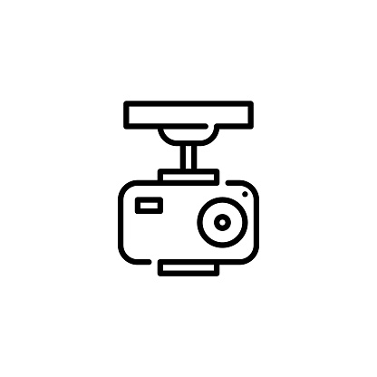
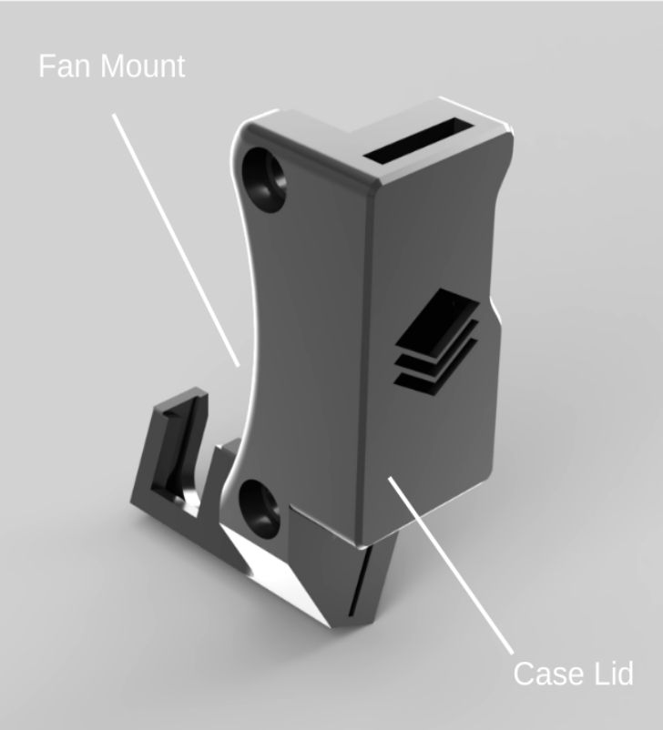
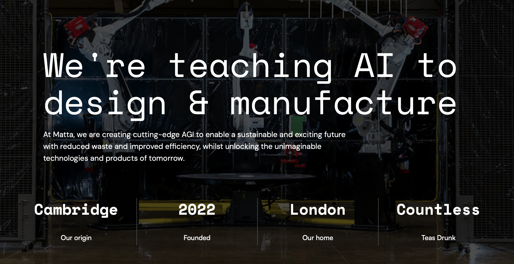

<!-- Improved compatibility of back to top link: See: https://github.com/othneildrew/Best-README-Template/pull/73 -->

<!--
*** Thanks for checking out the Best-README-Template. If you have a suggestion
*** that would make this better, please fork the repo and create a pull request
*** or simply open an issue with the tag "enhancement".
*** Don't forget to give the project a star!
*** Thanks again! Now go create something AMAZING! :D
-->

<!-- PROJECT SHIELDS -->
<!--
*** I'm using markdown "reference style" links for readability.
*** Reference links are enclosed in brackets [ ] instead of parentheses ( ).
*** See the bottom of this document for the declaration of the reference variables
*** for contributors-url, forks-url, etc. This is an optional, concise syntax you may use.
*** https://www.markdownguide.org/basic-syntax/#reference-style-links
-->
[![Contributors][contributors-shield]][contributors-url]
[![Forks][forks-shield]][forks-url]
[![Stargazers][stars-shield]][stars-url]
[![Issues][issues-shield]][issues-url]
[![MIT License][license-shield]][license-url]
[![LinkedIn][linkedin-shield]][linkedin-url]

<!-- PROJECT LOGO -->
 

  

<h3 align="center">Camera Mounts</h3>

  

    Welcome to the 3D Printer Camera Mounts GitHub repository! This project aims to provide a collection of camera mounts specifically for 3D printers. Attaching a camera to your printer allows for remote monitoring through OctoPrint or Klipper, time-lapse recording, and overall enhanced control of your printing processes.
     
     
    <a href="https://github.com/Matta-Labs/camera-mounts/issues">Report Problems</a>
    ·
    <a href="https://github.com/Matta-Labs/camera-mounts/issues">Request New Mounts!</a>
  

<!-- ABOUT THE PROJECT -->
## About The Project ⚡️

  
  
  

 

At <a href="https://matta.ai"><strong>Matta</strong></a>, we use computer vision and AI to turbocharge 3D printing. Our work often results in the generation of printable hardware to allow cameras to be mounted to 3D printers.
 
 
We thought it would be helpful to the community to release these into the wild - and build an open source repository where new designs/improvements can be shared! 
 
 

(<a href="#readme-top">back to top</a>)

### Introduction 🏁

Cameras mounted on 3D printers can be incredibly useful for various purposes. Whether you want to closely monitor your print progress, create stunning time-lapse videos, or remotely check on your printer's status, these 3D-printable camera mounts will come in handy. This repository serves as a hub for sharing various camera mount designs contributed by developers and designers in the community.
  

### Built With 🛠️

[![Fusion360][Fusion.360]][Fusion-url]

(<a href="#readme-top">back to top</a>)

<!-- USAGE EXAMPLES -->
## Usage ⚡️

The repo is broken-up into 3D printer brands. Navigate the repo to find your printer model, and browse the ReadMe's for printing/installation instruction. 
 
 
📸 Print, install and enjoy! Please leave feedback in FEEDBACK.md file within each mount directory.
 
 
All files should be accompanied by relevant documentation - raise an issue if not! 🚩

(<a href="#readme-top">back to top</a>)

<!-- CONTRIBUTING -->
## Contributing 👏🏼

Contributions are what make the open source community such an amazing place to learn, inspire, and create. Any contributions you make are **greatly appreciated**.

If you have any exisiting camera mounts you are willing to share with the community, please do! We want to create the largest open source repo of 3D printer camera mounts on the internet! 

1. Fork the Project
2. Create a Branch for your Contribution (`git checkout -b Ultimaker-S5`)
3. Commit your Changes (`git commit -m 'Added nozzle mount for Ultimaker S5'`)
4. Push to the Branch (`git push origin Ultimaker-S5`)
5. Open a Pull Request

### Contribution Steps 💡

1. **Upload STL/STEP Files:** Upload or provide links to the STL/STEP files of the shared/developed camera mounts
2. **Camera Mount Demonstration:** Include images and GIFs demonstrating the installation and usage of the camera mounts.
3. **Document improvements you want to see:** If you know of any shortcomings of your designs, raise them in Issues! Someone may already have a solution for you!

(<a href="#readme-top">back to top</a>)

<!-- ROADMAP -->
## Roadmap 🚴🏼‍♂️

- [x] Prusa
  - [x] i3 MK3S
    - [x] Nozzle camera
    - [ ] Bed camera

- [x] Creality
  - [x] Ender 3/Ender 3 Pro
    - [x] Nozzle camera
    - [ ] Bed camera
  - [x] Ender S1
    - [x] Nozzle camera
    - [ ] Bed camera
  - [x] CR-20
    - [x] Nozzle camera
    - [ ] Bed camera
- [ ] Ultimaker
- [ ] Voron
- [ ] Raise3D
- [ ] RatRig
- [ ] Makerbot
- [ ] BCN

See the [open issues](https://github.com/Matta-Labs/camera-mounts/issues) for a full list of proposed mount designs (and known issues).

(<a href="#readme-top">back to top</a>)

<!-- LICENSE -->
## License 📄

Distributed under the MIT License. See `LICENSE.txt` for more information.

(<a href="#readme-top">back to top</a>)

<!-- MORE ABOUT MATTA -->
## More About Matta 🔷

  

At <a href="https://matta.ai"><strong>Matta</strong></a>, we are building AI to push the boundaries of manufacturing. We train neural networks using vision to become manufacturing copilots, enabling next-generation error correction, material qualitification and part QC.

<a href="https://matta.ai/greymatta"><strong>Check out our first-iteration AI, Grey-1</strong></a>

<!-- CONTACT -->
## Contact 📞

Team Matta - [@mattaai](https://twitter.com/mattaai) - hello@matta.ai

Project Link: [https://github.com/Matta-Labs/camera-mounts](https://github.com/Matta-Labs/camera-mounts)

(<a href="#readme-top">back to top</a>)

<!-- ACKNOWLEDGMENTS -->
## Acknowledgments

* [Complex Additive Materials Group, University of Cambridge](https://github.com/cam-cambridge)

(<a href="#readme-top">back to top</a>)

<!-- MARKDOWN LINKS & IMAGES -->
<!-- https://www.markdownguide.org/basic-syntax/#reference-style-links -->
[contributors-shield]: https://img.shields.io/github/contributors/Matta-Labs/camera-mounts.svg?style=for-the-badge
[contributors-url]: https://github.com/Matta-Labs/camera-mounts/graphs/contributors
[forks-shield]: https://img.shields.io/github/forks/Matta-Labs/camera-mounts.svg?style=for-the-badge
[forks-url]: https://github.com/Matta-Labs/camera-mounts/network/members
[stars-shield]: https://img.shields.io/github/stars/Matta-Labs/camera-mounts.svg?style=for-the-badge
[stars-url]: https://github.com/Matta-Labs/camera-mounts/stargazers
[issues-shield]: https://img.shields.io/github/issues/Matta-Labs/camera-mounts.svg?style=for-the-badge
[issues-url]: https://github.com/Matta-Labs/camera-mounts/issues
[license-shield]: https://img.shields.io/github/license/Matta-Labs/camera-mounts.svg?style=for-the-badge
[license-url]: https://github.com/Matta-Labs/camera-mounts/blob/master/LICENSE.txt
[linkedin-shield]: https://img.shields.io/badge/-LinkedIn-black.svg?style=for-the-badge&logo=linkedin&colorB=555
[linkedin-url]: https://www.linkedin.com/company/mattaai
[de-gif]: images/data-engine.gif
[Fusion.360]: https://img.shields.io/badge/Autodesk-Fusion%20360-FC6E26?style=for-the-badge&logo=autodesk&logoColor=white
[Fusion-url]: https://autodesk.com/products/fusion360/overview
