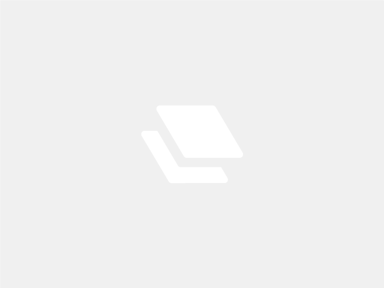

<!-- WHEN SHARING MOUNTS, FILL OUT THIS TEMPLATE AND ADD AS 'README.md' IN MOUNT FOLDER-->

<!-- HEADER -->
 

  <a href="https://github.com/Matta-Labs/camera-mounts">
    <!-- PLEASE UPLOAD IMAGE OF MOUNT TO IMAGES/ AND ADD IT HERE-->
    
  </a>

<h3 align="center">Mount: {mount-name} </h3>

  

    {Brief mount description: which printer, what camera type, how involved is installation, etc.}
     
     
    <a href="https://github.com/Matta-Labs/camera-mounts/issues">Report Problems</a>

  

<!-- ABOUT THE PROJECT -->
## Mount Details

<b>Compatible Printer:</b> {model name}
 
 
<b>Compatible Camera:</b> {model-name and link for online purchase}
 
 

### Built With 🛠️

These badges can be made using the method described in the docs here: https://github.com/alexandresanlim/Badges4-README.md-Profile

* [![Fusion360][Fusion.360]][Fusion-url]

<!-- INSTALLATION -->
## Installation ⚡️

Add instructions for slicing, printing and installation here. Creating a step-by-step guide with images is **highly encouraged!**

  <b>Slicing/Printing</b>

  1. Step 1 
  2. Step 2
  3. Step 3...
   
   

  <b>Installation</b>

  1. Step 1 
  2. Step 2
  3. Step 3...
   
   

📸 Print, install and enjoy! Please leave feedback for this mount in the appropriate FEEDBACK.md file.

<!-- LICENSE -->
## License 📄

Distributed under the MIT License. See `LICENSE.txt` for more information.

<!-- CONTACT -->
## Contact 📞

{contact-name} - [twitter-handle](twitter-link) - {contact-email}

<!-- ACKNOWLEDGMENTS -->
## Acknowledgments

* 
* 
* 

<!-- MARKDOWN LINKS & IMAGES -->
<!-- https://www.markdownguide.org/basic-syntax/#reference-style-links -->
[Fusion.360]: https://img.shields.io/badge/Autodesk-Fusion%20360-FC6E26?style=for-the-badge&logo=autodesk&logoColor=white
[Fusion-url]: https://autodesk.com/products/fusion360/overview
