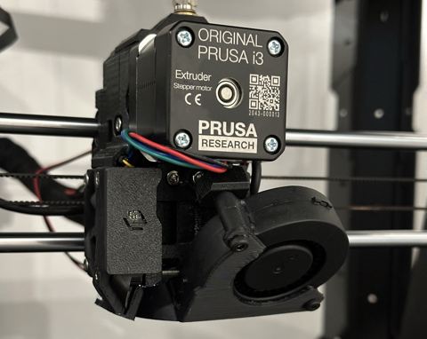
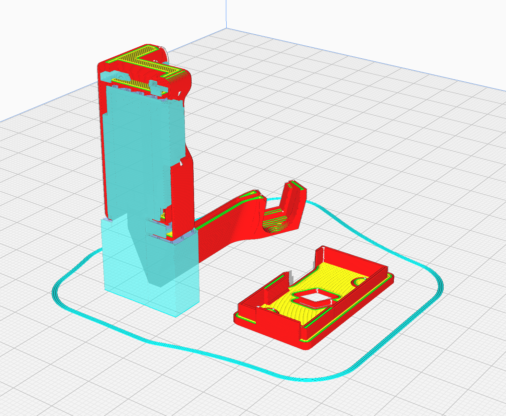
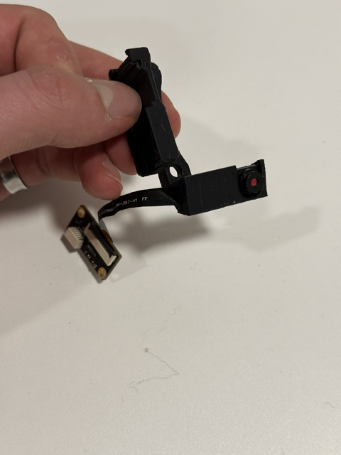
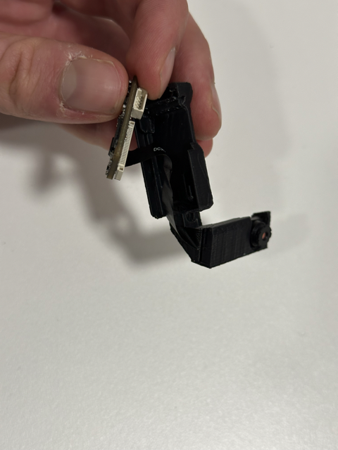
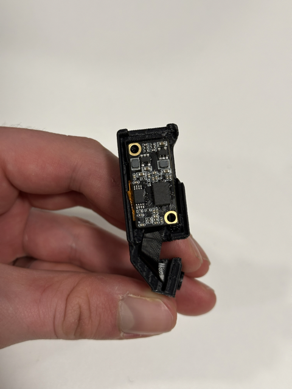
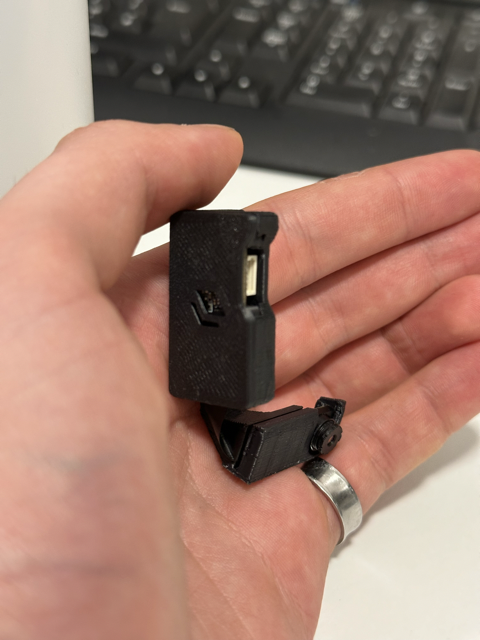
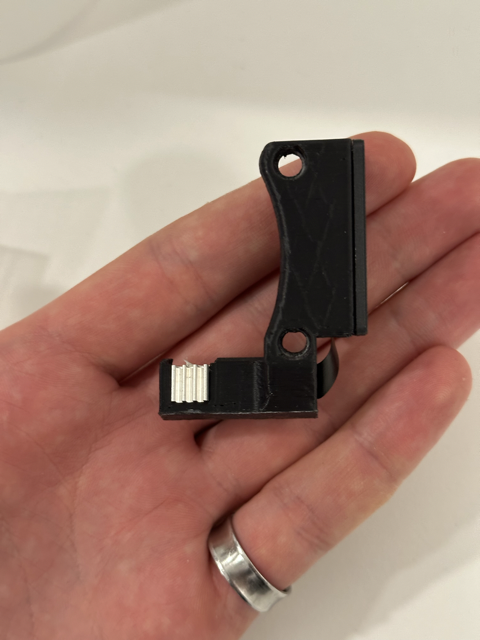
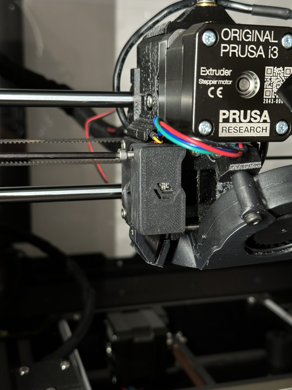
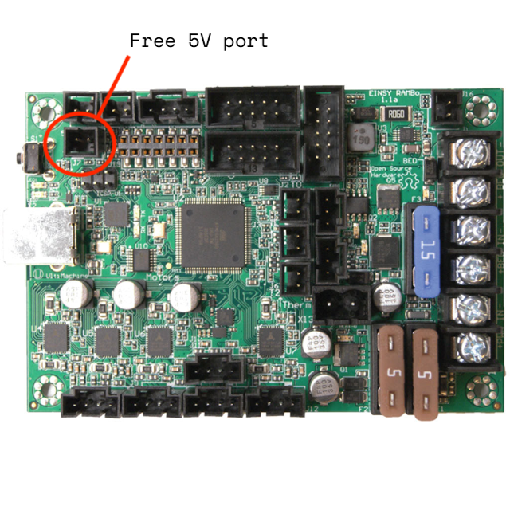

<!-- WHEN SHARING MOUNTS, FILL OUT THIS TEMPLATE AND ADD AS 'README.md' IN MOUNT FOLDER-->

<!-- HEADER -->
 

  

<h3 align="center">Mount: MattaMod Prusa i3 MK3S Camera Module Mount </h3>

  

    This is a simple, two-piece mount to allow a cheap, off-the-shelf camera module to work as a nozzle camera for the Prusa i3 MK3S 3D printer. 
     
     
    <a href="https://github.com/Matta-Labs/camera-mounts/issues">Report Problems</a>

  

<!-- ABOUT THE PROJECT -->
## Mount Details

<b>Compatible Printer:</b> Prusa i3 MK3S
 
 
<b>Compatible Camera:</b> OV5640 Camera Module (66º Fixed Focus HD 5MP) - https://shorturl.at/bfxX8
 
<b>Other useful components:</b> Longer camera cable - https://shorturl.at/sCEY2, heatsinks for camera module - https://shorturl.at/jQX79
 

### Built With 🛠️

* [![Fusion360][Fusion.360]][Fusion-url]

<!-- INSTALLATION -->
## Installation ⚡️

We recommend printing in ASA, for thermal resistance, PLA will quickly warp due to the heat of the camera.

  <b>Slicing/Printing</b>

  1. Slice with normal or tree supports, with the base of the mount flat against the bed.
  

  2. We usually recommend a layer height of 0.2mm, and a brim for bed adhesion.
   
  3. Print in ASA.
   
   

  <b>Installation</b>

  1. Carefully insert the camera unit into the housing, and press down until you feel a click.
   
  

   
  2. Route the ribbon cable up into the board housing and carefully fold so that it is tucked behind the board
   
  

   
  3. Click the board into place, and then cover with the case lid
   
  

  

   
  4. Add a 7x7x3mm heatsink to the back of the camera unit
   
  

   
  5. Use two M3 20mm bolts to secure the mount to the right hand side of the hotend fan.
   
  

   
  6. Route the camera cable as you wish, see our fs-cable-router or lgx-cable-router components for reference. We usually route the cable into the Prusa's cable sleeve for tidiness. The longer cable listed is helpful to ensure there is enough length to connect to your Pi/Laptop.
   

<!-- Lighting -->
## Lighting (Example) 🔦

  The Prusa extruder occludes a lot of light, meaning the area under the nozzle is rather dark. To get around this, it is advantageous to build some kind of light source incident on the nozzle. 
   
  Below is an example of how we tackled this issue with our internal printers:

  <b>Required components:</b> Matta LED holder parts, 24 AWG wiring, Pre-wired LED - https://shorturl.at/gpvT9, Soldering Kit, Molex Crimp connector parts - https://shorturl.at/rvCX1, https://shorturl.at/mpruV

  1. Print LED holder in ASA. There are different versions of this for the standard and BondTech versions of the mount.
   
  

   
  2. Solder the Pre-wired LED onto lengths of the 24 AWG wire, such that the wiring can be ran from the Einsey board, all the way to the nozzle.
    
  

   
  3. Use crimps to add the male Molex holder to the end of the LED wire
   
  

   
  4. Connect the LED with the Molex connector to the highlighted, free port on the Einsey board.
   
  

   

 

📸 Print, install and enjoy! Please leave feedback for this mount in the appropriate FEEDBACK.md file.

<!-- LICENSE -->
## License 📄

Distributed under the MIT License. See `LICENSE.txt` for more information.

<!-- CONTACT -->
## Contact 📞

Tom Walker - [tomwalkr](https://github.com/tom-walkr) - tom@matta.ai

<!-- MARKDOWN LINKS & IMAGES -->
<!-- https://www.markdownguide.org/basic-syntax/#reference-style-links -->
[Fusion.360]: https://img.shields.io/badge/Autodesk-Fusion%20360-FC6E26?style=for-the-badge&logo=autodesk&logoColor=white
[Fusion-url]: https://autodesk.com/products/fusion360/overview
